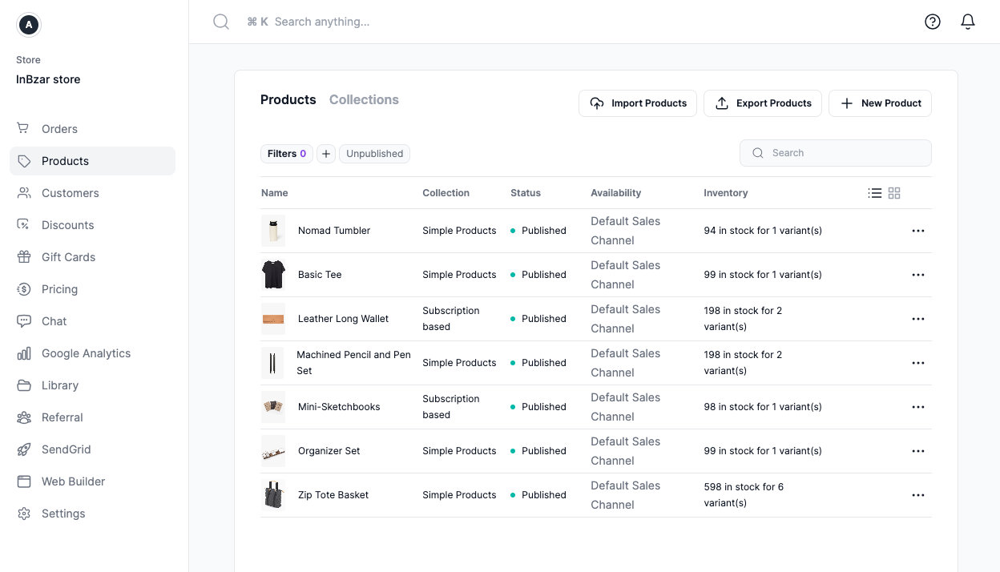
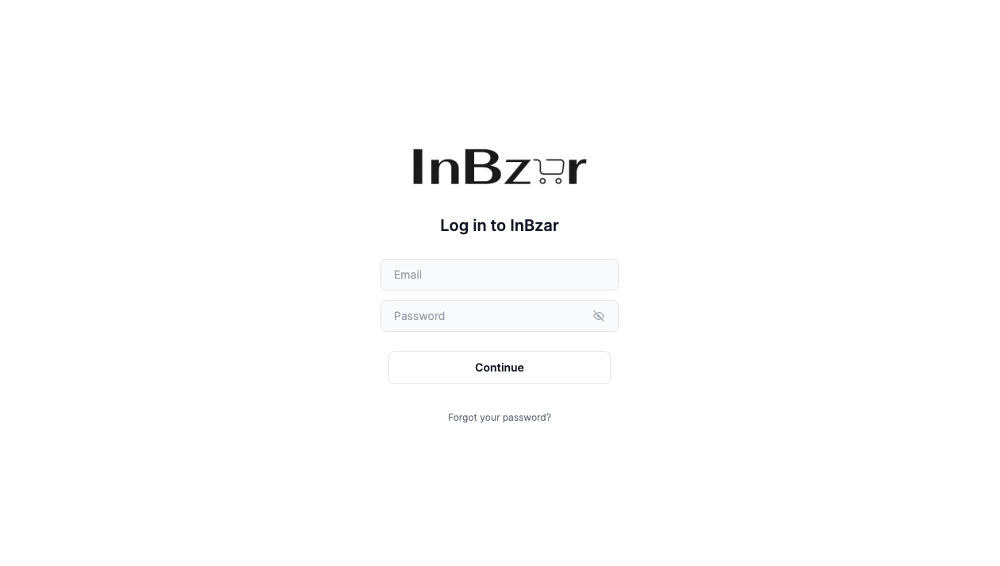
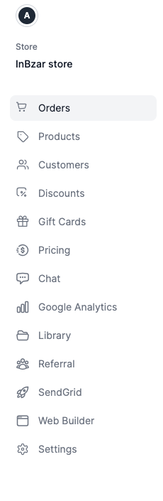

## Welcome to InBzar’s User Guide

This user guide is intended to help users learn how they can use the InBzar Admin to perform different operational and ecommerce tasks.

## Accessing the InBzar Admin

To access the admin panel of your ecommerce store, go to this URL [Admin Login](https://admin.inbzar.com)
Once you open the URL, you’ll be asked to log in.

You must use your user’s email and password to log in. If you’re unsure what your email and password are, please contact us.

## Tour of InBzar Admin

After you log into your InBzar Admin, you can see a sidebar menu, a search bar at the top, some icons at the top right, and in the middle the content of the page you’re currently on.

### Sidebar Menu
The sidebar menu includes the main navigation of your InBzar Admin. You can use it to navigate between different pages, such as Products or Orders pages.

### Search Bar
You’ll find at the top of the page a search bar. You can use this search bar to search orders, products, customers, and more information available in your InBzar Admin.

You can select a result with your mouse. Alternatively, use the up and down arrows on your keyboard to navigate between the results, then choosing a result by hitting the Enter key.

### Quick Actions

At the top left in the sidebar, you’ll find an avatar icon. By clicking this icon, you’ll see a dropdown. You can use this dropdown to access settings or sign out.

### Need Help

At the top right, you’ll find a  icon. When you click on this icon, a form will pop up. You can use this form to send the InBzar team a message asking for help. The InBzar team usually responds in a few hours on business days.

